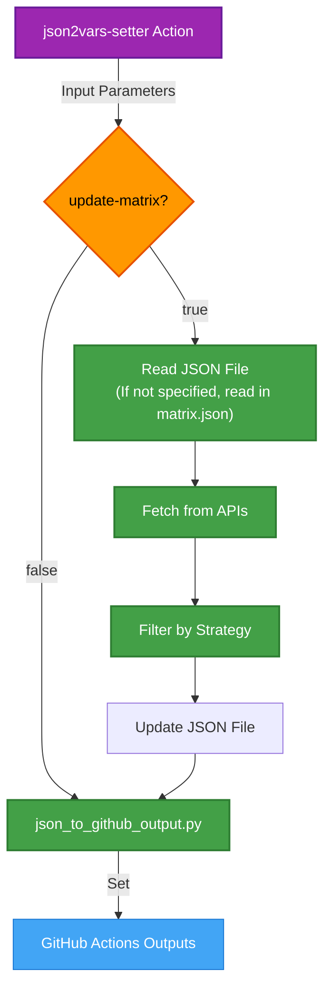
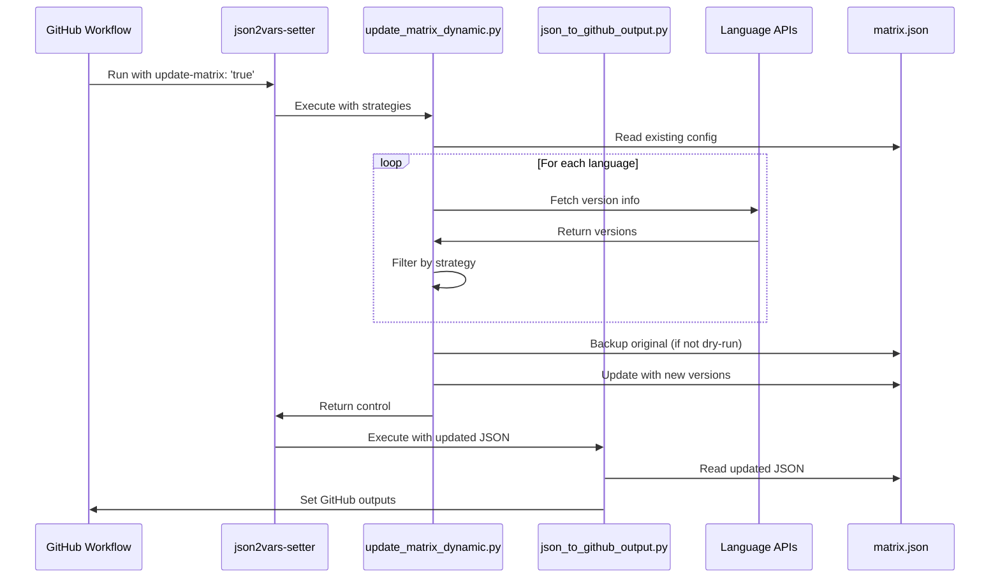

# Dynamic Matrix Update

The Dynamic Matrix Updater (`update_matrix_dynamic.py`) automatically updates your matrix configuration with the latest or stable language versions from official sources.

## Overview

This component eliminates the need for manual version updates in your testing matrices. It fetches language version information from official APIs and updates your matrix JSON file based on specified strategies, ensuring your CI/CD workflows always test against relevant language versions.



## Features

### Update Strategies

The updater provides flexible version selection through three distinct strategies:

1. **`stable`**: Include only stable versions of the language
   - Ideal for production environments and critical workflows
   - Focuses on reliability and backward compatibility

2. **`latest`**: Include only the latest versions (including pre-releases)
   - Perfect for cutting-edge testing and forward compatibility checks
   - Ensures your code works with upcoming language releases

3. **`both`**: Include both stable and latest versions
   - Comprehensive coverage for both stability and future-proofing
   - Best for libraries and frameworks that need wide compatibility

### Configurable Per Language

One of the key advantages is the ability to specify different update strategies for each supported language, giving you fine-grained control over your testing matrix:

```yaml
- name: Set variables from dynamically updated JSON
  id: json2vars
  uses: 7rikazhexde/json2vars-setter@main
  with:
    json-file: .github/json2vars-setter/matrix.json
    update-matrix: 'true'
    python-strategy: 'stable'
    nodejs-strategy: 'latest'
    ruby-strategy: 'both'
```

### Dry Run Mode

Test your update strategies without modifying your JSON file using the dry-run option:

```yaml
- name: Test dynamic update without changing files
  id: json2vars
  uses: 7rikazhexde/json2vars-setter@main
  with:
    json-file: .github/json2vars-setter/matrix.json
    update-matrix: 'true'
    all: 'latest'
    dry-run: 'true'
```

This helps you verify your configuration and see what changes would be made before committing to them.

### Backup Creation

The updater automatically creates a backup of your original matrix file before making changes, providing an easy fallback if needed.

## Usage Examples

### Basic Example

```yaml
name: Use Dynamic Matrix Update

jobs:
  build_and_test:
    runs-on: ubuntu-latest
    outputs:
      os: ${{ steps.json2vars.outputs.os }}
      versions_python: ${{ steps.json2vars.outputs.versions_python }}
    steps:
      - name: Checkout repository
        uses: actions/checkout@v4

      - name: Set variables with dynamic update
        id: json2vars
        uses: 7rikazhexde/json2vars-setter@main
        with:
          json-file: .github/json2vars-setter/matrix.json
          update-matrix: 'true'
          all: 'latest'

      # Use the outputs directly
      - name: Display matrix info
        run: |
          echo "OS: ${{ steps.json2vars.outputs.os }}"
          echo "Python versions: ${{ steps.json2vars.outputs.versions_python }}"
```

### Language-Specific Strategies

You can mix and match update strategies for different languages:

```yaml
- name: Set variables with mixed update strategies
  id: json2vars
  uses: 7rikazhexde/json2vars-setter@main
  with:
    json-file: .github/json2vars-setter/matrix.json
    update-matrix: 'true'
    python-strategy: 'stable'
    nodejs-strategy: 'latest'
    go-strategy: 'both'
```

### Periodic Updates with Scheduled Workflows

Create a scheduled workflow to keep your matrix up-to-date automatically:

```yaml
name: Update Matrix Weekly

on:
  schedule:
    - cron: '0 0 * * 0'  # Run every Sunday at midnight

jobs:
  update_matrix:
    runs-on: ubuntu-latest
    steps:
      - name: Checkout repository
        uses: actions/checkout@v4

      - name: Update matrix.json
        uses: 7rikazhexde/json2vars-setter@main
        with:
          json-file: .github/json2vars-setter/matrix.json
          update-matrix: 'true'
          all: 'stable'

      - name: Commit changes
        run: |
          git config --local user.email "actions@github.com"
          git config --local user.name "GitHub Actions"
          git add .github/json2vars-setter/matrix.json
          git commit -m "Update testing matrix with latest stable versions" || echo "No changes to commit"
          git push
```

## Input Parameters

The Dynamic Matrix Updater accepts the following inputs:

| Input | Description | Required | Default |
|-------|-------------|----------|---------|
| `json-file` | Path to the JSON file | Yes | - |
| `update-matrix` | Whether to update the matrix | No | `'false'` |
| `update-strategy` | Default strategy for all languages | No | - |
| `python-strategy` | Strategy for Python versions | No | - |
| `nodejs-strategy` | Strategy for Node.js versions | No | - |
| `ruby-strategy` | Strategy for Ruby versions | No | - |
| `go-strategy` | Strategy for Go versions | No | - |
| `rust-strategy` | Strategy for Rust versions | No | - |
| `dry-run` | Run without updating the file | No | `'false'` |

## How It Works

When you set `update-matrix: 'true'`, the action performs these steps internally:

1. **Load Existing Configuration**: The specified JSON file is loaded to retain its structure
2. **Fetch Version Information**: For each language with a specified strategy, it contacts the official API
3. **Apply Update Strategy**: Versions are filtered based on the specified strategy for each language
4. **Create a Backup**: Before making changes, a backup of the original file is created (unless in dry-run mode)
5. **Update the Matrix**: The JSON file is updated with the new version information
6. **Parse JSON**: The updated JSON file is processed by json_to_github_output.py
7. **Set Outputs**: The values from the JSON file are set as GitHub Actions outputs



## Supported Languages

The Dynamic Matrix Updater currently supports:

- **Python**: Fetches from Python releases via GitHub API
- **Node.js**: Fetches from Node.js release API
- **Ruby**: Fetches from Ruby releases via GitHub API
- **Go**: Fetches from Go releases via GitHub API
- **Rust**: Fetches from Rust releases via GitHub API

## Best Practices

- **Use `dry-run: 'true'`** to test your update strategy before implementing it
- **Create a scheduled workflow** to update your matrix on a regular basis (weekly or monthly)
- **For critical workflows**, use the `stable` strategy to avoid potential issues with latest releases
- **For bleeding-edge testing**, use the `latest` strategy
- **For libraries and frameworks**, use the `both` strategy to ensure wide compatibility
- **Set up automated commits** after updates to keep your repository in sync
- **Consider combining with version caching** for larger projects to optimize API usage (note: do not use both `update-matrix: 'true'` and `use-cache: 'true'` together; they are separate strategies)

## Common Issues and Solutions

| Issue | Solution |
|-------|----------|
| API rate limits | Use GitHub authentication by setting up the `GITHUB_TOKEN` environment variable |
| No versions found | Check your JSON structure - versions should be under `versions.<language>` |
| Errors parsing JSON | Ensure your JSON file is valid and has the expected structure |
| Unexpected version changes | Use `dry-run: 'true'` to preview changes before applying them |

## Next Steps

- Learn how to [version caching](version-caching.md) your matrix configurations
- See [basic examples](../examples/basic.md) of complete workflow configurations
- Review the [command options](../reference/options.md) reference for all available options
