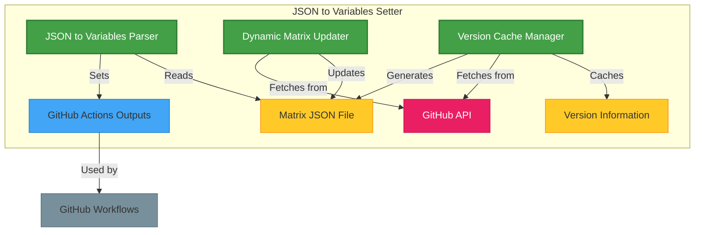
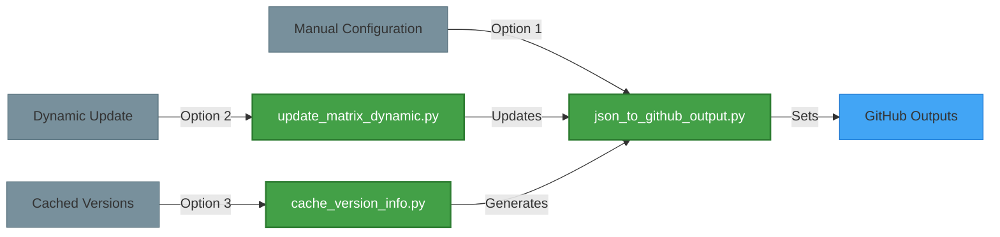

# Features Overview

JSON to Variables Setter (json2vars-setter) provides a comprehensive set of features to streamline the management of GitHub Actions workflow configurations. The action consists of three main components that work together to provide a powerful and flexible solution.

## Core Components



### 1. JSON to Variables Parser (`json_to_github_output.py`)

The core component of the action. It reads a JSON configuration file and converts its contents into GitHub Actions output variables that can be used in your workflows.

#### Key Capabilities

- Parse JSON files into GitHub Actions outputs
- Support for nested structures with appropriate naming conventions
- Efficient handling of array data for matrix strategies
- Convert complex data structures into workflow-friendly formats

[Learn more about JSON to Variables](json-to-variables.md)

### 2. Dynamic Matrix Updater (`update_matrix_dynamic.py`)

Automatically updates your matrix configuration with the latest or stable language versions from official sources.

#### Key Capabilities

- Update matrix configuration on-the-fly during workflow execution
- Select between latest versions, stable versions, or both
- Configurable update strategies per language
- Dry-run mode for testing before committing changes

[Learn more about Dynamic Updates](dynamic-update.md)

### 3. Version Cache Manager (`cache_version_info.py`)

Manages version information cache to optimize API usage and workflow performance.

#### Key Capabilities

- Cache version information to reduce API calls
- Configurable cache expiration and refresh policies
- Incremental updates to build version history
- Template generation from cached data
- Sort versions in ascending or descending order

[Learn more about Version Caching](version-caching.md)

## How These Components Work Together

The components of json2vars-setter can be used independently or in combination:



1. **Basic Usage**: Use only the JSON parser to read your manually maintained matrix file
2. **Automated Matrix Updates**: Combine the Dynamic Updater with the parser to always test against the latest versions
3. **Optimized CI/CD**: Utilize all three components for an efficient, up-to-date testing infrastructure with minimal API calls

## Use Cases

- **Standardized Matrix Testing**: Define testing environments once and reference them consistently across workflows
- **Automated Version Updates**: Keep testing matrices current without manual intervention
- **Efficient API Usage**: Reduce external API calls by caching version information
- **Cross-Platform Testing**: Define operating systems and language versions for comprehensive testing
- **Multi-Language Projects**: Support for Python, Ruby, Node.js, Go, and Rust in a single configuration

## Component Integration

The flexibility of json2vars-setter allows you to choose the components that best suit your project's needs:

### Basic Configuration (Manual JSON)

```yaml
- name: Set variables from JSON
  id: json2vars
  uses: 7rikazhexde/json2vars-setter@v1.0.2
  with:
    json-file: .github/json2vars-setter/sample/matrix.json
```

### Dynamic Updates (Automated Version Management)

```yaml
- name: Update matrix with latest versions
  uses: 7rikazhexde/json2vars-setter@v1.0.2
  with:
    json-file: .github/json2vars-setter/sample/matrix.json
    update-matrix: 'true'
    python-strategy: 'stable'
    nodejs-strategy: 'latest'
```

### Version Caching (Optimized API Usage)

```yaml
- name: Update using cached version info
  uses: 7rikazhexde/json2vars-setter@v1.0.2
  with:
    json-file: .github/json2vars-setter/sample/matrix.json
    use-cache: 'true'
    cache-max-age: '7'
    cache-incremental: 'true'
```

Choose the components that best suit your project's needs, from simple variable parsing to fully automated matrix management.
