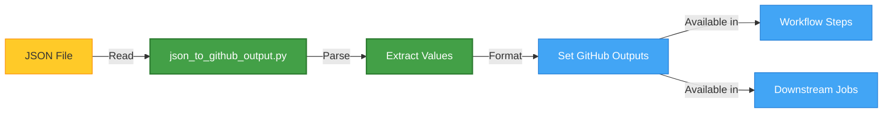

# JSON to Variables

The JSON to Variables Parser (`json_to_github_output.py`) is the core component of the json2vars-setter action. It reads a JSON configuration file and sets its values as output variables in GitHub Actions workflows.

## Overview

This component serves as the foundation of the entire action, transforming static JSON configuration into dynamic workflow variables. It parses a JSON file and converts its contents into GitHub Actions output variables, making them available for use in subsequent steps or jobs in your workflow.



## Features

### Smart JSON Parsing

The parser recursively processes JSON data, handling various data types and structures:

- **Simple Values**: Scalar values like strings or numbers
- **Arrays**: Lists of values, preserved as JSON strings for matrix usage
- **Nested Objects**: Complex hierarchical structures with appropriate naming

### Array Support for Matrix Strategies

One of the key features is its ability to handle arrays, which are essential for GitHub Actions matrix strategies. Arrays are preserved as JSON strings, making them directly usable with `fromJson()` in matrix configurations:

```yaml
strategy:
  matrix:
    os: ${{ fromJson(needs.set_variables.outputs.os) }}
    python-version: ${{ fromJson(needs.set_variables.outputs.versions_python) }}
```

### Automated Naming Conventions

The component applies appropriate naming conventions for GitHub Actions outputs:

- **Key Standardization**: Variables are converted to uppercase
- **Nested Object Handling**: Keys are concatenated with underscores for nested objects
- **Consistent Output Format**: Array elements are preserved in JSON format for easy parsing

## How It Works

The parser works in the following steps:

1. **Read JSON File**: The file is read from the specified path
2. **Parse Structure**: The JSON structure is recursively parsed
3. **Transform Data**: Values are converted to appropriate formats for GitHub Actions
4. **Set Outputs**: All parsed variables are set as GitHub Actions outputs

For example, when processing this JSON structure:

```json
{
  "os": ["ubuntu-latest", "windows-latest"],
  "versions": {
    "python": ["3.10", "3.11", "3.12"]
  }
}
```

The parser generates these outputs:

- `os`: `["ubuntu-latest", "windows-latest"]`
- `versions_python`: `["3.10", "3.11", "3.11"]`

## Usage

### Basic Example

```yaml
- name: Set variables from JSON
  id: json2vars
  uses: 7rikazhexde/json2vars-setter@main
  with:
    json-file: .github/json2vars-setter/sample/matrix.json
```

### Accessing Variables

#### Within the Same Job

You can access the variables within the same job using the `steps` context:

```yaml
- name: Use variables
  run: |
    echo "OS List: ${{ steps.json2vars.outputs.os }}"
    echo "First OS: ${{ fromJson(steps.json2vars.outputs.os)[0] }}"
    echo "Python Versions: ${{ steps.json2vars.outputs.versions_python }}"
```

#### In Subsequent Jobs

You can use the variables in subsequent jobs with the `needs` context:

```yaml
jobs:
  set_variables:
    # Job that sets variables
    outputs:
      os: ${{ steps.json2vars.outputs.os }}
      versions_python: ${{ steps.json2vars.outputs.versions_python }}

  use_variables:
    needs: set_variables
    runs-on: ${{ fromJson(needs.set_variables.outputs.os)[0] }}
    steps:
      - name: Set up Python
        uses: actions/setup-python@v5
        with:
          python-version: ${{ fromJson(needs.set_variables.outputs.versions_python)[0] }}
```

## JSON File Example

```json
{
    "os": [
        "ubuntu-latest",
        "windows-latest",
        "macos-latest"
    ],
    "versions": {
        "python": [
            "3.10",
            "3.11",
            "3.12"
        ]
    },
    "ghpages_branch": "gh-pages"
}
```

This example generates the following output variables:

- `os`: `["ubuntu-latest", "windows-latest", "macos-latest"]`
- `versions_python`: `["3.10", "3.11", "3.12"]`
- `ghpages_branch`: `"gh-pages"`

## Advanced Usage

### Working with Array Variables in Shell Scripts

When using list variables in shell scripts, use single quotes to preserve the JSON structure:

```yaml
- name: Process variables in shell
  run: |
    # Store JSON arrays with single quotes to preserve structure
    os_list='${{ steps.json2vars.outputs.os }}'
    python_versions='${{ steps.json2vars.outputs.versions_python }}'

    # Use jq to process JSON arrays
    first_os=$(echo "$os_list" | jq -r '.[0]')
    echo "First OS: $first_os"

    # Process all versions
    echo "$python_versions" | jq -r '.[]' | while read version; do
      echo "Setting up Python $version"
    done
```

### Accessing Individual Elements Directly

For direct access to specific array elements:

```yaml
- name: Access array elements
  run: |
    echo "Second OS: ${{ fromJson(steps.json2vars.outputs.os)[1] }}"
    echo "First Python version: ${{ fromJson(steps.json2vars.outputs.versions_python)[0] }}"
```

## Considerations

- **Variable Size Limits**: GitHub Actions has limits on environment variable sizes
- **JSON Parsing**: List variables are serialized as JSON strings, requiring `fromJson()` when used
- **Naming Conflicts**: Avoid duplicate keys in your JSON as they may cause unpredictable behavior
- **Debugging**: Use `--debug` flag with the script for verbose output when troubleshooting

## Technical Details

The `json_to_github_output.py` script:

1. Accepts a JSON file path as input
2. Uses Python's `json` module to parse the file
3. Recursively processes all elements using the `parse_json` function
4. Writes to the `GITHUB_OUTPUT` environment file using the format required by GitHub Actions

By understanding the internal workings of this component, you can leverage its full power to create dynamic, maintainable workflows.

## Next Steps

- Learn how to [dynamically update](dynamic-update.md) your matrix configurations
- Learn how to [version caching](version-caching.md) your matrix configurations
- See [basic examples](../examples/basic.md) of complete workflow configurations
- Review the [command options](../reference/options.md) reference for all available options
