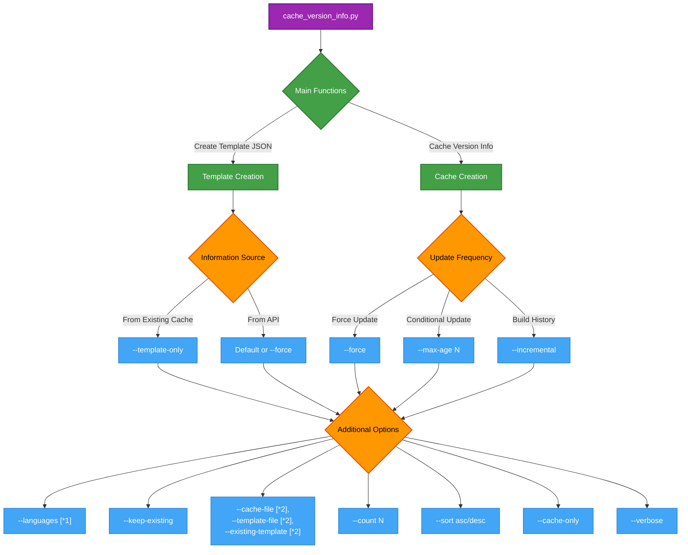
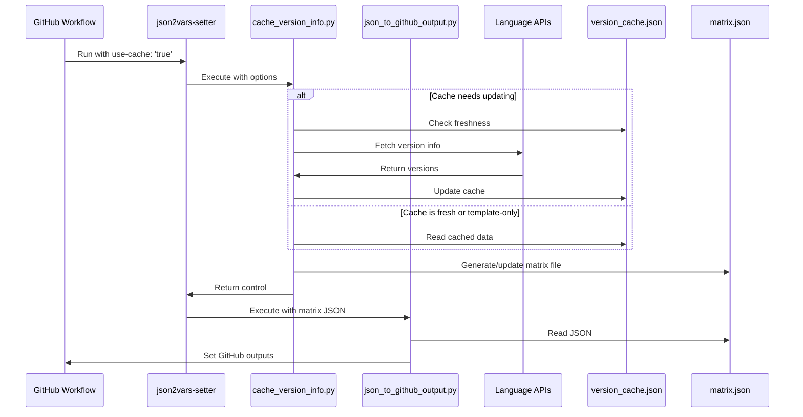

# Version Caching

The Version Cache Manager (`cache_version_info.py`) manages version information cache to optimize API usage and workflow performance.

## Overview

This component reduces external API calls by caching version information, making your workflows faster and more resilient. It's especially useful for frequently run workflows or environments with API rate limits.

## Component Overview



!!! tip "[*1]: Specify language"

    - Specify languages separated by **spaces**; if `all` is specified, all target languages are retrieved.
    - Target languages: `python`, `nodejs`, `ruby`, `go`, `rust`

!!! tip "[*2]: specify a path"

    - If the file does not exist in the path, an error will occur, so please create it beforehand.

## Command Line Options

| Option | Description | Default |
|--------|-------------|---------|
| `--template-only` | Generate template from existing cache (`version_cache.json`) without API requests | None |
| `--force` | Force update regardless of existing cache | None |
| `--max-age N` | Update cache only after N days<br>Compares with `last_updated` value in existing cache | 1 day |
| `--incremental` | Add new versions to existing cache (build history) | None |
| `--languages` | Specify target languages<br>Separate multiple languages with spaces<br>Supported: python, nodejs, ruby, go, rust | all |
| `--count N` | Number of versions to keep per language | 10 |
| `--keep-existing` | Maintain information for non-specified languages | None |
| `--cache-file` | Path to cache file | Default path |
| `--template-file` | Path to output template file | Default path |
| `--existing-template` | Path to existing template to maintain structure | None |
| `--sort` | Version sort order (desc: newest first, asc: oldest first) | desc |
| `--cache-only` | Update cache only, don't generate template | None |
| `--verbose` | Output detailed logs | None |

## Common Usage Examples

### Template Creation

#### Generate template from existing cache without API calls

```bash
python json2vars_setter/cache_version_info.py --template-only
```

#### Update specific languages only (maintain other language information)

```bash
python json2vars_setter/cache_version_info.py --template-only --languages python --keep-existing
```

#### Fetch latest information from API and create template

```bash
python json2vars_setter/cache_version_info.py
```

### Cache Creation and Management

#### Force fetch latest information

```bash
python json2vars_setter/cache_version_info.py --force
```

#### Update only after a certain period (e.g., 7 days)

```bash
python json2vars_setter/cache_version_info.py --max-age 7
```

#### Accumulate version history (add new versions)

```bash
python json2vars_setter/cache_version_info.py --incremental --count 30
```

## Advanced Usage

### Custom File Specification

#### Output to specific file

```bash
python json2vars_setter/cache_version_info.py --template-file ./my_matrix.json
```

#### Maintain existing file structure

```bash
python json2vars_setter/cache_version_info.py --existing-template ./project_matrix.json --template-file ./updated_matrix.json
```

### CI/CD Integration

#### Scheduled job (cache update only)

```bash
python json2vars_setter/cache_version_info.py --max-age 7 --cache-only
```

#### Pre-build processing (template generation only)

```bash
python json2vars_setter/cache_version_info.py --template-only
```

## GitHub Actions Integration

In GitHub Actions, these options are mapped to action inputs:

```yaml
- name: Set variables with cached versions
  id: json2vars
  uses: 7rikazhexde/json2vars-setter@main
  with:
    json-file: .github/json2vars-setter/matrix.json
    use-cache: 'true'
    cache-languages: 'python,nodejs'
    cache-max-age: '7'
    keep-existing: 'true'
    sort-order: 'desc'
```

Note that the version caching strategy (`use-cache: 'true'`) and dynamic update strategy (`update-matrix: 'true'`) cannot be used together as they represent different approaches to managing version information.

## How It Works

When you set `use-cache: 'true'`, the action performs these steps internally:

1. **Check Cache Freshness**: The manager checks if the cache is fresh based on `cache-max-age`
2. **Fetch Version Info**: If needed, it fetches new version information from APIs for the specified languages
3. **Update Cache**: It updates the cache file with the new information
4. **Generate Template**: It creates or updates the matrix JSON file based on the cached data
5. **Parse JSON**: The matrix JSON file is processed by json_to_github_output.py
6. **Set Outputs**: The values from the JSON file are set as GitHub Actions outputs



## Best Practices

- **Use `use-cache: 'true'` with `cache-max-age`** to avoid unnecessary API calls while keeping versions updated
- **Use template-only mode** (`template-only: 'true'`) for quick template generation from existing cache
- **Use incremental mode** (`cache-incremental: 'true'`) with `cache-count` to build comprehensive version history
- **Use `keep-existing: 'true'`** when updating only specific languages to maintain existing configuration
- **Set up a scheduled job** for cache maintenance and a separate job for template generation
- **Never use `use-cache: 'true'` and `update-matrix: 'true'` together** as they are mutually exclusive approaches

## GitHub API Authentication

When fetching version information from GitHub APIs, you might encounter rate limits, especially in CI/CD environments where many workflows run frequently.

!!! tip "Avoiding API Rate Limits"
    To increase your API rate limits, add the `GITHUB_TOKEN` as an environment variable:

    ```yaml
    - name: Set variables with cached versions
      id: json2vars
      uses: 7rikazhexde/json2vars-setter@main
      with:
        json-file: .github/json2vars-setter/matrix.json
        use-cache: 'true'
        cache-languages: 'python,nodejs'
      env:
        GITHUB_TOKEN: ${{ secrets.GITHUB_TOKEN }}
    ```

    This allows the action to authenticate with GitHub, significantly increasing your API rate limits.

!!! warning "API Rate Limit Issues"
    If you encounter `API rate limit exceeded` errors, refer to the [Troubleshooting Guide](../examples/troubleshooting.md#api-rate-limit-exceeded) for more detailed solutions.

## Common Issues and Solutions

| Issue | Solution |
|-------|----------|
| API rate limits | Use GitHub authentication by setting up the `GITHUB_TOKEN` environment variable |
| Missing versions | Increase the `cache-count` value to fetch more versions |
| Incorrect sort order | Explicitly set `sort-order: 'asc'` or `sort-order: 'desc'` as needed |
| Cache not updating | Use `force-cache-update: 'true'` to force an update |
| Empty template | Check that the cache file exists or use `force-cache-update: 'true'` to create it |

## Next Steps

- See [basic examples](../examples/basic.md) for simple cache usage patterns
- Explore [advanced examples](../examples/advanced.md) for complex caching scenarios
- Check the [command options](../reference/options.md) for complete reference
