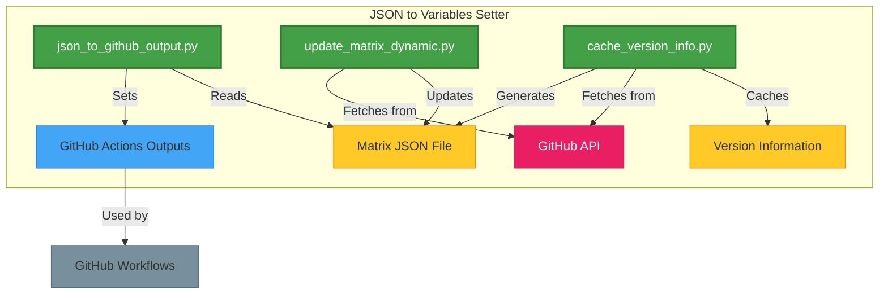

# JSON to Variables Setter

[](https://github.com/marketplace/actions/json-to-variables-setter)

## Overview

**JSON to Variables Setter (json2vars-setter)** is a GitHub Action that parses a JSON file and sets its values as output variables in GitHub Actions workflows. This action streamlines the management of matrix testing configurations and other workflow variables, making your CI/CD processes more maintainable and adaptable.

By centralizing your configuration in JSON files, you gain the ability to easily manage and update testing environments across multiple workflows, reducing duplication and maintenance overhead.

## Key Features

- **JSON Parsing**: Convert JSON files into GitHub Actions output variables for use in your workflows
- **Dynamic Version Management**: Automatically update your testing matrix with latest language versions from official sources
- **Version Caching**: Cache version information to reduce API calls and improve workflow performance
- **Support for Multiple Languages**: Compatible with Python, Ruby, Node.js, Go, and Rust
- **Flexible Configuration**: Maintain a single source of truth for your matrix testing environments

## Supported Matrix Components

| Languages | Test Status |
|-------|-------|
|  | [](https://github.com/7rikazhexde/json2vars-setter/actions/json2vars-setter/python_test.yml) |
|  | [](https://github.com/7rikazhexde/json2vars-setter/actions/json2vars-setter/ruby_test.yml) |
|  | [](https://github.com/7rikazhexde/json2vars-setter/actions/json2vars-setter/nodejs_test.yml) |
|  | [](https://github.com/7rikazhexde/json2vars-setter/actions/json2vars-setter/go_test.yml) |
|  | [](https://github.com/7rikazhexde/json2vars-setter/actions/json2vars-setter/rust_test.yml) |

## Quick Start

```yaml
jobs:
  set_variables:
    runs-on: ubuntu-latest
    outputs:
      os: ${{ steps.json2vars.outputs.os }}
      versions_python: ${{ steps.json2vars.outputs.versions_python }}
      ghpages_branch: ${{ steps.json2vars.outputs.ghpages_branch }}
    steps:
      - name: Checkout repository
        uses: actions/checkout@v4.2.2

      - name: Set variables from JSON
        id: json2vars
        uses: 7rikazhexde/json2vars-setter@main
        with:
          json-file: .github/json2vars-setter/matrix.json
```

## Components

The action consists of three main components that work together to provide a powerful, flexible solution:



1. **JSON to Variables Parser** (`json_to_github_output.py`): Core component that parses JSON and converts it to GitHub Actions outputs. Makes your configuration data accessible throughout your workflow.

2. **Dynamic Matrix Updater** (`update_matrix_dynamic.py`): Updates your matrix configuration with the latest or stable language versions. Ensures your CI/CD tests run against current language versions without manual updates.

3. **Version Cache Manager** (`cache_version_info.py`): Manages cached version information to optimize API usage. Reduces external API calls by intelligently caching data, improving workflow performance and reliability.

## Learn More

- [Getting Started](getting-started.md) - Basic setup and configuration
- [Features](features/index.md) - Detailed explanation of all features
- [Usage Examples](examples/basic.md) - Common usage patterns and examples
- [Command Options](reference/options.md) - Complete reference of all available options
