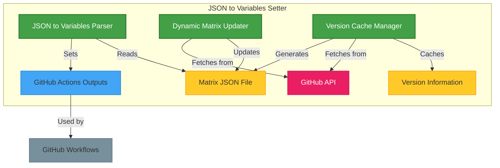

# JSON to Variables Setter

[](https://github.com/marketplace/actions/json-to-variables-setter)

## Overview

**JSON to Variables Setter (json2vars-setter)** is a GitHub Action that parses a JSON file and sets its values as output variables in GitHub Actions workflows. This action streamlines the management of matrix testing configurations and other workflow variables, making your CI/CD processes more maintainable and adaptable.

By centralizing your configuration in JSON files, you gain the ability to easily manage and update testing environments across multiple workflows, reducing duplication and maintenance overhead.

## Key Features

- **JSON Parsing**: Convert JSON files into GitHub Actions output variables for use in your workflows
- **Dynamic Version Management**: Automatically update your testing matrix with latest language versions from official sources
- **Version Caching**: Cache version information to reduce API calls and improve workflow performance
- **Support for Multiple Languages**: Compatible with Python, Ruby, Node.js, Go, Rust, PHP, .NET (C#), Java, Deno, Bun, Zig, Elixir, Dart, and Swift
- **Flexible Configuration**: Maintain a single source of truth for your matrix testing environments

## Supported Matrix Components

| Languages | Actions | Example Test Status |
|-------|-------|-------|
|  | [](https://github.com/marketplace/actions/setup-python) | [](https://github.com/7rikazhexde/json2vars-setter/actions/workflows/python_test.yml) |
|  | [](https://github.com/marketplace/actions/setup-ruby-jruby-and-truffleruby) | [](https://github.com/7rikazhexde/json2vars-setter/actions/workflows/ruby_test.yml) |
|  | [](https://github.com/marketplace/actions/setup-node-js-environment) | [](https://github.com/7rikazhexde/json2vars-setter/actions/workflows/nodejs_test.yml) |
|  | [](https://github.com/marketplace/actions/setup-go-environment) | [](https://github.com/7rikazhexde/json2vars-setter/actions/workflows/go_test.yml) |
|  | [](https://github.com/marketplace/actions/rustup-toolchain-install) | [](https://github.com/7rikazhexde/json2vars-setter/actions/workflows/rust_test.yml) |
|  | [](https://github.com/marketplace/actions/setup-php-action) | [](https://github.com/7rikazhexde/json2vars-setter/actions/workflows/php_test.yml) |
|  | [](https://github.com/marketplace/actions/setup-net-core-sdk) | [](https://github.com/7rikazhexde/json2vars-setter/actions/workflows/dotnet_test.yml) |
|  | [](https://github.com/marketplace/actions/setup-java-jdk) | [](https://github.com/7rikazhexde/json2vars-setter/actions/workflows/java_test.yml) |
|  | [](https://github.com/marketplace/actions/setup-deno) | [](https://github.com/7rikazhexde/json2vars-setter/actions/workflows/deno_test.yml) |
|  | [](https://github.com/marketplace/actions/setup-bun) | [](https://github.com/7rikazhexde/json2vars-setter/actions/workflows/bun_test.yml) |
|  | [](https://github.com/marketplace/actions/setup-zig-compiler) | [](https://github.com/7rikazhexde/json2vars-setter/actions/workflows/zig_test.yml) |
|  | [](https://github.com/marketplace/actions/setup-beam) | [](https://github.com/7rikazhexde/json2vars-setter/actions/workflows/elixir_test.yml) |
|  | [](https://github.com/marketplace/actions/setup-dart-sdk) | [](https://github.com/7rikazhexde/json2vars-setter/actions/workflows/dart_test.yml) |
|  | [](https://github.com/marketplace/actions/setup-swift) | [](https://github.com/7rikazhexde/json2vars-setter/actions/workflows/swift_test.yml) |
|  | [](https://github.com/marketplace/actions/setup-julia-environment) | [](https://github.com/7rikazhexde/json2vars-setter/actions/workflows/julia_test.yml) |
|  | [](https://github.com/marketplace/actions/install-crystal) | [](https://github.com/7rikazhexde/json2vars-setter/actions/workflows/crystal_test.yml) |
|  | [](https://github.com/marketplace/actions/setup-haskell) | [](https://github.com/7rikazhexde/json2vars-setter/actions/workflows/haskell_test.yml) |
|  | [](https://github.com/marketplace/actions/set-up-ocaml) | [](https://github.com/7rikazhexde/json2vars-setter/actions/workflows/ocaml_test.yml) |

## Sample Workflows

Beyond the per-language tests above, these **runnable use-case samples** live in the repository and execute on real GitHub Actions. The green badge is proof you can reproduce the result, then copy the files into your own project — no local setup required to gain confidence.

| Use case | Status | What it demonstrates | Files |
|----------|--------|----------------------|-------|
| Single source of truth | [](https://github.com/7rikazhexde/json2vars-setter/actions/workflows/sample_single_source.yml) | One JSON parsed once, then consumed by an independent `test` matrix **and** a separate `lint` job — define versions in one place, use them everywhere | [workflow](https://github.com/7rikazhexde/json2vars-setter/blob/main/.github/workflows/sample_single_source.yml) · [example](https://github.com/7rikazhexde/json2vars-setter/tree/main/examples/showcase) |

## Quick Start

!!! info "See [Basic Usage Examples](https://7rikazhexde.github.io/json2vars-setter/examples/basic/) for details."

```yaml
jobs:
  set_variables:
    runs-on: ubuntu-latest
    outputs:
      os: ${{ steps.json2vars.outputs.os }}
      versions_python: ${{ steps.json2vars.outputs.versions_python }}
      ghpages_branch: ${{ steps.json2vars.outputs.ghpages_branch }}
    steps:
      - name: Checkout repository
        uses: actions/checkout@v6.0.3

      - name: Set variables from JSON
        id: json2vars
        uses: 7rikazhexde/json2vars-setter@v1.9.1
        with:
          json-file: .github/json2vars-setter/sample/matrix.json

  run_tests:
    needs: set_variables
    strategy:
      matrix:
        os: ${{ fromJson(needs.set_variables.outputs.os) }}
        python-version: ${{ fromJson(needs.set_variables.outputs.versions_python) }}
    runs-on: ${{ matrix.os }}
    steps:
      - name: Checkout repository
        uses: actions/checkout@v6.0.3
        with:
          fetch-depth: 0

      - name: Set up Python
        uses: actions/setup-python@v6.2.0
        with:
          python-version: ${{ matrix.python-version }}
      # Other steps
```

## Components

The action consists of three main components that work together to provide a powerful, flexible solution:


```mermaid
graph TD
    subgraph "JSON to Variables Setter"
        A[JSON to Variables Parser ] -->|Reads| B[Matrix JSON File]
        A -->|Sets| C[GitHub Actions Outputs]

        D[Dynamic Matrix Updater] -->|Updates| B
        D -->|Fetches from| E[GitHub API]

        F[Version Cache Manager] -->|Caches| G[Version Information]
        F -->|Fetches from| E
        F -->|Generates| B
    end

    C -->|Used by| I[GitHub Workflows]

    classDef core fill:#43a047,stroke:#2e7d32,stroke-width:2px,color:#fff
    classDef file fill:#ffca28,stroke:#fb8c00,stroke-width:1px,color:#333333
    classDef output fill:#42a5f5,stroke:#1976d2,stroke-width:1px
    classDef external fill:#78909c,stroke:#546e7a,stroke-width:1px
    classDef api fill:#e91e63,stroke:#c2185b,stroke-width:1px,color:#fff

    class A,D,F core
    class B,G file
    class C output
    class I external
    class E api
```

1. **JSON to Variables Parser** (`github_output.py`): Core component that parses JSON and converts it to GitHub Actions outputs. Makes your configuration data accessible throughout your workflow.

2. **Dynamic Matrix Updater** (`matrix_update.py`): Updates your matrix configuration with the latest or stable language versions. Ensures your CI/CD tests run against current language versions without manual updates.

3. **Version Cache Manager** (`version_cache.py`): Manages cached version information to optimize API usage. Reduces external API calls by intelligently caching data, improving workflow performance and reliability.

## Learn More

- [Getting Started](getting-started.md) - Basic setup and configuration
- [Features](features/index.md) - Detailed explanation of all features
- [Usage Examples](examples/basic.md) - Common usage patterns and examples
- [Command Options](reference/options.md) - Complete reference of all available options
